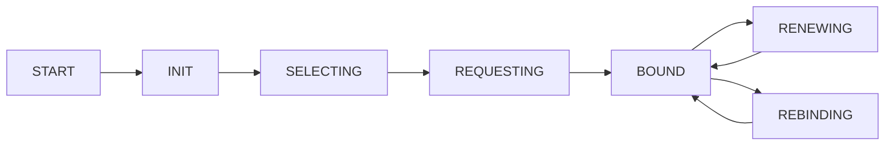

# DHCP 客户端

## 概述

DHCP (Dynamic Host Configuration Protocol) 用于自动获取网络配置参数（IP、网关、DNS 等）。

## 源文件

- `src/core/ipv4/dhcp.c` - DHCP 实现
- `include/lwip/dhcp.h` - 头文件

## 启用 DHCP

```c
// lwipopts.h
#define LWIP_DHCP             1
```

## API

### 启动 DHCP

```c
#include "lwip/dhcp.h"

struct netif *netif = &your_netif;

// 启动 DHCP 客户端
dhcp_start(netif);
```

### 检查状态

```c
// 获取 DHCP 信息
struct dhcp *dhcp = netif_dhcp_data(netif);

if (dhcp != NULL) {
    printf("DHCP state: %d\n", dhcp->state);
    
    if (dhcp->state == DHCP_STATE_BOUND) {
        printf("IP: %s\n", ipaddr_ntoa(&netif->ip_addr));
        printf("GW: %s\n", ipaddr_ntoa(&netif->gw));
        printf("DNS: %s\n", ipaddr_ntoa(&dns_getserver(0)));
    }
}
```

### 停止 DHCP

```c
dhcp_stop(netif);
```

### 续租

```c
// 手动续租
dhcp_renew(netif);

// 释放 IP
dhcp_release(netif);
```

## DHCP 状态机



## 配置选项

```c
// lwipopts.h
#define DHCP_MAX_MSG_LEN       1024    // DHCP 消息最大长度
#define DHCP_MAX_OPT_LEN       128     // 选项最大长度
#define DHCP_COARSE_TIMER_SECS 60      // 粗粒度定时器
#define DHCP_FINE_TIMER_MSECS  10      // 细粒度定时器
```

## 事件回调

```c
// 可以在 sys_now() 或定时器中检查 DHCP 状态变化
void check_dhcp_events(struct netif *netif) {
    struct dhcp *dhcp = netif_dhcp_data(netif);
    
    switch (dhcp->state) {
        case DHCP_STATE_BOUND:
            // 获取到 IP
            break;
        case DHCP_STATE_RENEWING:
            // 正在续租
            break;
        case DHCP_STATE_BACKING_OFF:
            // 等待重试
            break;
    }
}
```

## DHCP 服务器模式

lwIP 不支持 DHCP 服务器，但可以使用 `contrib/apps/dhcps` 第三方实现。

## 相关文件

- [[网络接口]] - netif 结构
- [[DNS 客户端]] - DHCP 获取的 DNS 配置
