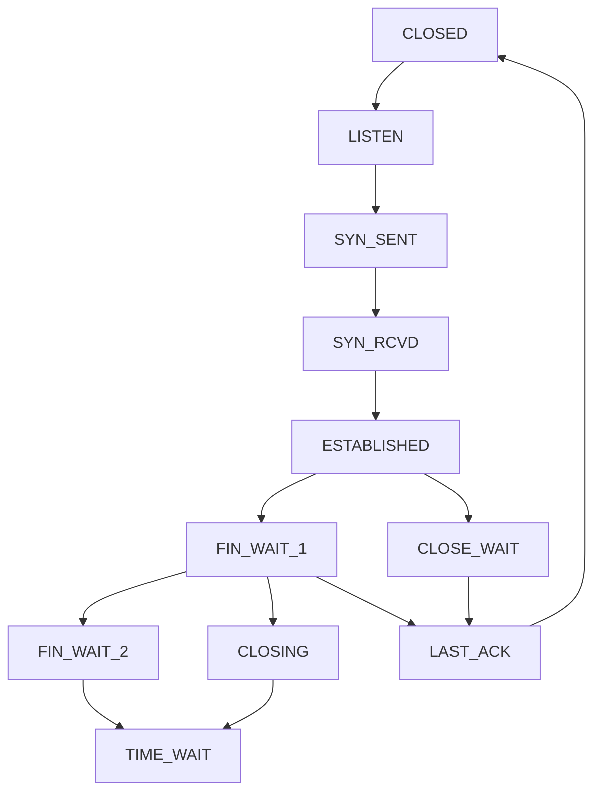

# TCP 协议

## 概述

TCP (Transmission Control Protocol) 是面向连接的可靠传输协议，在 lwIP 中提供完整的 TCP 实现。

## 源文件

- `src/core/tcp.c` - TCP 主逻辑
- `src/core/tcp_in.c` - TCP 输入处理
- `src/core/tcp_out.c` - TCP 输出处理
- `include/lwip/tcp.h` - 头文件

## TCP PCB (Protocol Control Block)

```c
struct tcp_pcb {
    ip_addr_t remote_ip;      // 远程 IP
    u16_t remote_port;         // 远程端口
    u16_t local_port;         // 本地端口
    
    // 状态机
    enum tcp_state state;     // TCP 状态
    
    // 发送窗口
    u32_t snd_nxt;            // 下一个序列号
    u32_t snd_wnd;            // 发送窗口
    u32_t snd_queuelen;       // 发送队列长度
    
    // 接收窗口  
    u32_t rcv_nxt;            // 期望序列号
    u32_t rcv_wnd;            // 接收窗口
};
```

## TCP 状态机



## API

### 服务器端

```c
#include "lwip/tcp.h"

// 创建 PCB
struct tcp_pcb *tcp_new(void);

// 绑定到端口
err_t tcp_bind(struct tcp_pcb *pcb, ip_addr_t *ip, u16_t port);

// 开始监听
struct tcp_pcb *tcp_listen(struct tcp_pcb *pcb);

// 接受连接
err_t tcp_accept(struct tcp_pcb *pcb, err_t (*accept)(void *, struct tcp_pcb *, err_t));
```

### 客户端

```c
// 连接服务器
err_t tcp_connect(struct tcp_pcb *pcb, ip_addr_t *ip, u16_t port,
                  err_t (*connected)(void *, struct tcp_pcb *, err_t));

// 发送数据
err_t tcp_write(struct tcp_pcb *pcb, const void *data, u16_t len, u8_t apiflags);
err_t tcp_sent(struct tcp_pcb *pcb, err_t (*sent)(void *, struct tcp_pcb *, u16_t));
```

### 接收数据

```c
// 注册回调
err_t tcp_recv(struct tcp_pcb *pcb, err_t (*recv)(void *, struct tcp_pcb *, struct pbuf *, err_t));
```

### 关闭连接

```c
// 主动关闭
err_t tcp_close(struct tcp_pcb *pcb);

// 异常处理
err_t tcp_err(struct tcp_pcb *pcb, void (*err)(void *, err_t));
```

## 示例：TCP Echo 服务器

```c
static err_t accept_callback(void *arg, struct tcp_pcb *new_pcb, err_t err) {
    tcp_arg(new_pcb, NULL);
    tcp_recv(new_pcb, recv_callback);
    return ERR_OK;
}

static err_t recv_callback(void *arg, struct tcp_pcb *tpcb, struct pbuf *p, err_t err) {
    if (p != NULL) {
        tcp_write(tpcb, p->payload, p->len, TCP_WRITE_FLAG_COPY);
        pbuf_free(p);
    } else {
        tcp_close(tpcb);
    }
    return ERR_OK;
}

void tcp_echo_server_init(void) {
    struct tcp_pcb *pcb = tcp_new();
    tcp_bind(pcb, IP_ADDR_ANY, 7);
    pcb = tcp_listen(pcb);
    tcp_accept(pcb, accept_callback);
}
```

## 配置选项

```c
// lwipopts.h
#define LWIP_TCP              1           // 启用 TCP
#define TCP_MSS               1460        // 最大段大小
#define TCP_WND               4096        // 窗口大小
#define TCP_SND_BUF           8192        // 发送缓冲区
#define TCP_LISTEN_BACKLOG    1           // 监听队列
```

## 定时器

TCP 使用定时器进行重传、保活等机制：

```c
// TCP 定时器 tick
#define TCP_TMR_INTERVAL      250        // ms

// 超时配置
#define TCP_TCP_RTO_MIN        1000       // ms
#define TCP_TCP_RTO_MAX        120000     // ms
```

## 相关文件

- [[UDP 协议]] - 无连接的 UDP
- [[BSD Socket API]] - Socket 接口
- [[数据包管理]] - TCP 如何使用 pbuf
