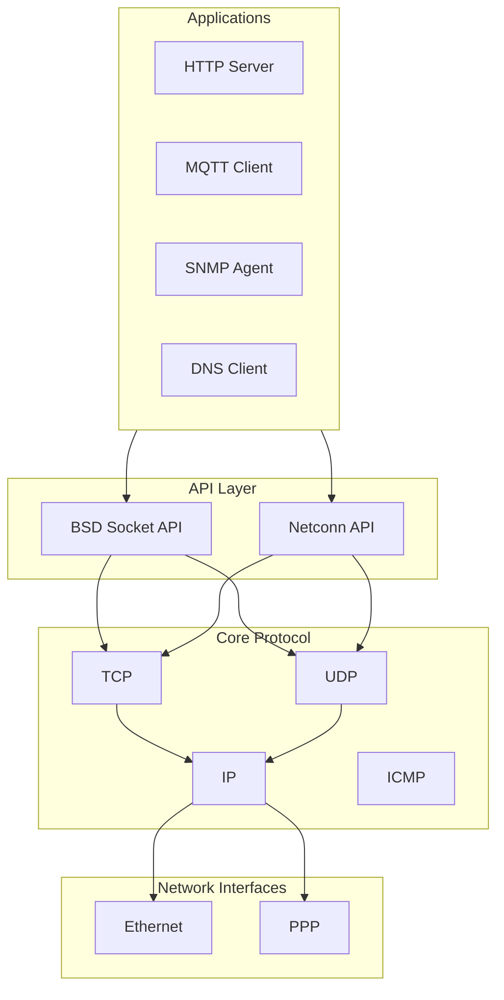

# lwIP 概述

## 简介

**lwIP** (Lightweight IP) 是一个开源的 TCP/IP 协议栈实现，专为嵌入式系统设计。它由 Adam Dunkels 开发，现在由 lwIP 团队维护。

## 核心特性

> [!info] 主要特点
> - **轻量级**：代码量小，内存占用低
> - **可移植性**：支持多种操作系统和平台
> - **完整性**：实现了完整的 TCP/IP 协议栈
> - **两种API**：支持 BSD Socket 和 Netconn API

## 架构图



## API 层级

### 1. 高级 API
- **BSD Socket API** - 标准的 POSIX 风格 socket 接口
- **Netconn API** - lwIP 原生的异步 API

### 2. 核心协议
- TCP - 可靠传输
- UDP - 不可靠传输
- IP - 网际协议
- ICMP - 网络控制消息

### 3. 底层接口
- Ethernet 接口
- PPP (Point-to-Point Protocol)

## 编译配置

lwIP 通过 `lwipopts.h` 进行配置，关键选项：

```c
// 启用/禁用模块
#define LWIP_TCP          1
#define LWIP_UDP          1
#define LWIP_DNS          1

// 内存池配置
#define MEM_SIZE          4096
#define MEMP_NUM_PBUF     16

// TCP 配置
#define TCP_WND           4096
#define TCP_MSS           1460
```

## 多线程模型

lwIP 支持两种模式：

| 模式 | 描述 | 适用场景 |
|------|------|----------|
| **NoSYS** | 单线程，无操作系统支持 | 简单嵌入式系统 |
| **With OS** | 多线程，操作系统支持 | 复杂应用 |

## 下一步

- [[内存管理]] - 了解 lwIP 的内存管理机制
- [[数据包管理]] - 了解 pbuf 管理
- [[学习路径]] - 规划学习顺序
